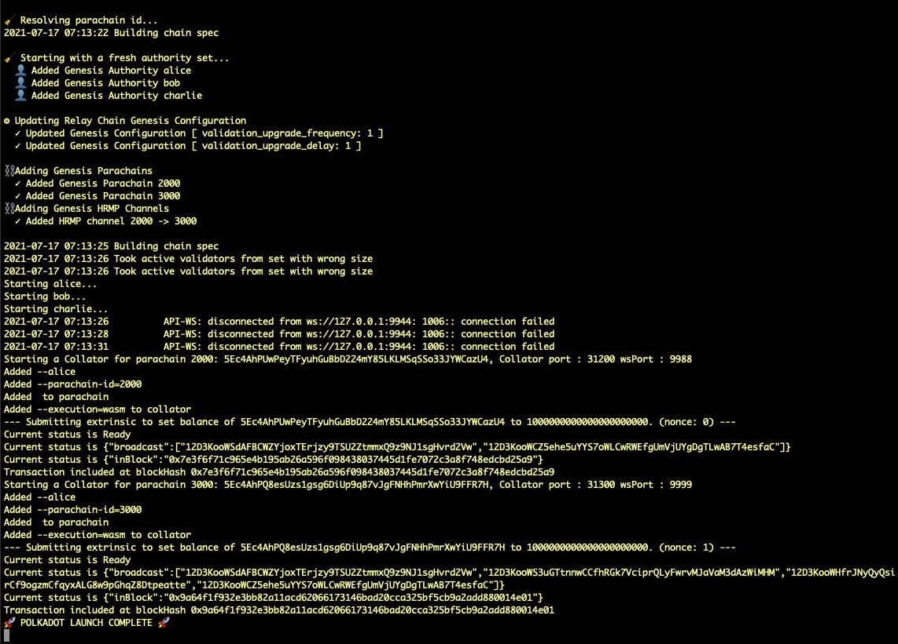

# Launching Relay Chain & Parachains with `polkadot-launch`

## Overview

Now that we have gone through the procedure of manually launching a relay chain of a few nodes, and a parachain. You might wonder this is all quite a hassle if you have to go through this exercise each time when developing and testing for parachain development.

Fortunately, there is actually a Node utility script, [`polkadot-launch`](https://github.com/paritytech/polkadot-launch) that automate all the previous process. But it will still be good to know what's involved under the hood, and when things go wrong, you know how it should be done and troubleshoot issues.

Now, let's install the utility script and try it out.

## Installation

Run the following command to install the script globally in your environment

```bash
yarn global add polkadot-launch
```

To verify it is installed properly, run the command below and should return you its current version.

```bash
polkadot-launch --version
# 1.6.2
```

## Kickstart

In this exercise, we will launch a **Polkadot relay chain of three nodes and two parachains, each with one node only**.

1. First get our Polkadot and Parachain Template binary compiled. [This section](/en/1-prep/1-compiling?id=building-the-polkadot-relay-chain-node) contains the instructions on getting Polkadot compiled, and [this section](/en/1-prep/1-compiling?id=building-the-parachain-template) for Parachain Template.

2. `polkadot-launch` reads a JSON config file to know all the config parameters required to launch its relaychain and parachain nodes. We have an example setup, and please [download it here](/shared/polkadot-launch-config/relay-3-2para-1.json). Let's take a look at what the file contains.

  Inside the `relaychain` key, we see:

    - `bin`: specify where the relay chain binary is
    - `chain`: the type of the relay chain we are launching. It could either be a chain type, e.g. `rococo-local`, or a chainspec filepath.
    - `nodes`: number of nodes we have. Here we have 3 nodes with three well-known addresses as the validator session keys, and their respective websocket port (`wsPort`) and TCP port (`port`) listened to.

  Inside the `parachains` key, we see two parachains defined, with:

    - `bin`: specify where the parachain collator binary is
    - `id`: the Para ID of the chain
    - `balance`: Initial balance to be set for well-known accounts
    - `nodes`: the nodes setting for the corresponding parachain. Setting are similar to those in relay chain. We only have one node setup per parachain.

  We will go through the rest of the options later.

3. Let's update the `bin` location for the relaychain and parachains to an absolute path where your binaries are located. For the two parachains, use the same Parachain Template binary.

  Now you could run with:

  ```bash
  polkadot-launch relay-3-2para-1.json
  ```

  If everything go well, you will be seeing something like the following:

  

4. Now open up another console and inspect the current directory, you will see the relay chain node logs are written to `alice.log`, `bob.log`, and `charlie.log`, while the parachain logs are indicated with the websocket port numbers they are listening to, so you should see `9988.log`and `9999.log` there.

  Another way to verify the setup is correct, is by going to [Polkadot-JS Apps **Network** - **Parachains** tab](https://polkadot.js.org/apps/#/parachains), after configure to connect to your relay chain node, you should see the UI showing two parachains being connected to the relay chain.

  

Congratulation! You have automated the launch of a 3-node relay chain, and two parachains with a single node using `polkadot-launch` CLI utility.

Next, we will go through in details the configuration parameters that `polkadot-launch` recognizes in the config file.

## `polkadot-launch` Configuration

The config file can broadly divided into five sections, shown below.

```json
{
  "relaychain": {
    //...
  },
  "parachains": [{
    //...
  }, {
    //...
  }],
  "simpleParachains": [{
    //...
  }, {
    //...
  }],
  "hrmpChannels": [{
    //...
  }],
  "types": {},
  "finalization": false
}
```

### `relaychain` Section

This section of JSON specifies how the relaychain should be launched. The full config looks like the following:

```json
"relaychain": {
  "bin": "./bin/polkadot",
  "chain": "rococo-local",
  "nodes": [
    {
      "name": "alice",
      "wsPort": 9944,
      "port": 30444,
      "basePath": "/tmp/alice",
      "flags": ""
    },
    {
      //...
    }
  ],
  "genesis": {
    "runtime": {
      "runtime_genesis_config": {
        "parachainsConfiguration": {
          "config": {
            "validation_upgrade_frequency": 1,
            "validation_upgrade_delay": 1
          }
        }
      }
    }
  }
}
```

We have gone through the `bin`, `chain`, and `nodes` [above](#kickstart).

For each node inside `nodes`, you could have the following keys:

- `name`: Must be one of `alice`, `bob`, `charlie`, or `dave`.
- `wsPort`: The websocket port for this node.
- `port`: The TCP port of this node.
- `basePath`: Where the chain database are going to be saved.If unspecified, the chain is run with `--tmp` flag.
- `flags`: Any addition flags that would be passed to the relay chain.

Finally, there is `genesis`. It is a JSON object of the properties you want to modify from the genesis configuration. Non-specified properties will be unchanged from the original genesis configuration. Regarding the `genesis` value, it is the same as all the values shown in the chainspec when generated by the following commands:

```bash
./polkadot build-spec --chain=rococo-local --disable-default-bootnode
```

### `parachains` Section

`parachains` is an array of objects, configuring how one or more parachains are to be launched. It looks like the following:

```json
"parachains": [
  {
    "bin": "./bin/polkadot-collator",
    "id": "2000",
    "balance": "1000000000000000000000",
    "nodes": [
      {
        "wsPort": 9988,
        "port": 31200,
        "name": "alice",
        "flags": ["--", "--execution=wasm"]
      }
    ]
  },
  {
    // ...
  }
]
```

- `bin`: The path of the collator node binary. Use an absolute path here.
- `id`: The Para ID assigned to this parachain. Must be unique.
- `balance`: (Optional) Configure a starting amount of balance on the relay chain for this chain's account ID.
- For each node in `nodes`, it has the same configuration as node config in the relay chain.

### `simpleParachains` Section

This is similar to parachains but for "simple" collators like the [adder-collator](https://github.com/paritytech/polkadot/tree/master/parachain/test-parachains/adder/collator), a very simple collator that lives in the polkadot repo and is meant for simple testing. It supports a subset of configuration values, and is meant to run with a single node only:

`simpleParachains` section is similar to `parachains` section:

```json
"simpleParachains": [
  {
    "bin": "./bin/adder-collator",
    "id": "400",
    "port": "31400",
    "name": "alice",
    "balance": "1000000000000000000000"
  }
]
```

- `bin`: The path to the collator binary.
- `id`: The id to assign to this parachain. Must be unique.
- `port`: The TCP port for this node.
- `balance`: (Optional) Configure a starting amount of balance on the relay chain for this chain's account ID.

### `hrmpChannels` Section

This section specifies HRMP channels to be open between the specified parachains so that it's possible to send messages between those. Keep in mind that an HRMP channel is unidirectional and in case you need to communicate both ways you need to open channels in both directions.

`hrmpChannels` looks similar to the following:

```json
"hrmpChannels": [
  {
    "sender": 2000,
    "recipient": 3000,
    "maxCapacity": 8,
    "maxMessageSize": 512
  }
]
```

### Remaining

Finally, we have `types`, and `finalization`.

- `types`: The custom Polkadot-JS custom types to be fed to Polkadot-JS API.
- `finalization`: either `true` or `false`, whether you want transaction submitted from `polkadot-launch` to wait for block finalization.

## How It Works

This tool just automates the steps you learned previously to spin up multiple relay chain nodes and parachain nodes in order to create a local test network. It also leverage on Polkadot-JS API to connect to these spawned nodes over their WebSocket endpoints.

## Conclusion

In this chapter we have covered about `polkadot-launch` Node utility. You are now able to build up your own config file, and launch a relay chain and parachains set all in just a single command.

This is a good basis to get to our next subject, actual parachain development.
