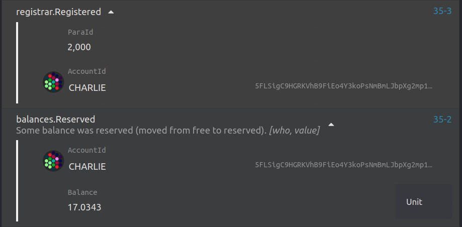

# Rococo Testnet Registration

## Parathread Registration

Rococo is Parity's official test network for cumulus-based parachains.

> **IMPORTANT NOTE:** As parachain is being developed in a fast pace, you need to use the
> corresponding tagged version of Cumulus and Polkadot for the relay-chain and parachain
> compatible to each others.
>
> Please test registering your parachain locally before attempting to connect to Rococo!

[**Polkadot `release-v0.9.10` branch**](https://github.com/paritytech/polkadot/tree/release-v0.9.10)

[**Cumulus `polkadot-v0.9.10` branch**](https://github.com/paritytech/cumulus/tree/polkadot-v0.9.10)

### 1. Request ROC Tokens

ROC is the native currency on the Rococo test network. You will need some ROC in order to
register your Rococo parachain.

You need to register on Rococo as a parathread before able to experiment on Rococo testnet.

> If you have any questions and comments regarding Rococo testnet, please join the
> [Rococo channel](https://matrix.to/#/#rococo:matrix.parity.io).
>
> On requesting the ROC tokens, please join the [Rococo faucet channel](https://matrix.to/#/#rococo-faucet:matrix.org).

### 2. Register as a Parathread

All parachains will need to register as a parathread first. You will need:

- **5 ROCs** deposit to register a Para ID.

- [Reserve a unique Para ID](en/2-relay-chain/2-reserve). This will be assigned to the next
  available ID. This integer will be greater than `2000`, as `0-999` are reserved for
  [system parachains](https://wiki.polkadot.network/docs/learn-common-goods#system-level-chains)
  and `1000-1999` are reserved for [public utility parachains](https://wiki.polkadot.network/docs/learn-common-goods#public-utility-chains).

- Your parachain genesis state. Refer to the
  [genesis state export process](en/3-parachains/1-launch.md#generate-parachain-genesis-state).

- Your parachain Wasm runtime. Refer to the
  [Wasm runtime export process](en/3-parachains/1-launch.md#obtain-wasm-runtime-validation-function).

The procedure will be as followed:

- Goto Polkadot-JS Apps [here](https://polkadot.js.org/apps/?rpc=wss%3A%2F%2Frococo-rpc.polkadot.io#/parachains/parathreads).

- Reserve for the next available Para ID.

  

- After successfully reserving your Para ID, you can now register as a **Parathread**.

  

- Once your extrinsic succeeds, you will see the `registrar.Registered` event being emitted.

  

- Also in the Polkadot-JS Apps [**Parachains > Parathreads** page](https://polkadot.js.org/apps/#/parachains/parathreads),
  you will see your parathread registration is **Onboarding**:

  

After the extrinsic succeeds, it takes [**2 sessions**](#relevant-settings) for the chain to
fully onboard as a parathread.

## Parachain Slot Auction

Parathead can then be transformed to parachain by winning a parachain slot auction. This guarantees
the now parachain will always have their block data hashed and included in the relay chain block
(called Proof of Validation, or short for **PoV**), during the slot duration they are alloted.

Only fully-onboarded Rococo parathreads are eligible to bid in a Rococo parachain slot auction. Common
goods chains can bypass auctions and become parachains through on-chain governance decision.

### Relevant Settings

Following are setting in the Rococo testnet that affect timing behavior on some parachain operations,
and are subject to change.

- Session length: 10 mins
- Lease Period Length: 14,400 Blocks (1 day)
- Ending Period: 600 Blocks (60 mins)
- Current Lease Period Index = Current Block Number / 14400

Note that transitions of a parachain/Parathread into a different state will take at least 2 sessions,
including on-boarding, off-boarding, upgrading, downgrading, etc.

### Bidding

Anyone with a fully onboarded parathread can make a bid to win a parachain slot for their Para ID.
They need to out-bid all others participating in the slot auction.

You can do so in Polkadot-JS App [**Network** > **Parachains** > **Auctions** page](https://polkadot.js.org/apps/?rpc=wss%3A%2F%2Frococo-rpc.polkadot.io#/parachains/auctions).

Pick your Para ID, how much you want to bid, and the slots you want to bid for:

## Crowdloans

You may also choose to harness your community and get their supports in winning the parachain
slot auction. In this case, you would start a crowdloan campaign so your supporters can
loan your project their tokens to win the auction. These tokens will be held in custody during the
auction process, and if won, the whole slot leasing duration also.

You will not do this for a testnet parachain slot, but you may consider this option for a mainnet
parachain slot.

### Start a Crowdloan Campaign

In the following, we are getting ready to submit an extrinsic to start a crowdloan.

Notes on the parameters:

- `parachain id`: You can only create a crowdloan campaign for a Para ID that you registered.

- `crowdfund cap`: The maximum amount your crowdloan campaign can collect. This is just a responsible
  measure for getting external support.

- `ending block`: This is when you want your crowdloan to end. If you know an auction will start in
  3 days, and last for 5 days, you probably want to set your crowdloan to end in 10 days, a time with
  a little buffer at the end. This way you will be sure that your crowdloan is active during the
  entire auction process. On the other hand, you don't want to set your crowdloan period to be too
  long, or else prolong the community funds lock up period unnecessarily and discouraging them to
  participate in your campaign.

- `first period` / `last period`: The slot duration you want to bid for. So if the current auction
  has slots 3 - 6 open, these values can be any number in between.

- You can cancel a crowdloan as long as you have not received a contribution.

If your extrinsic succeeds, you can see your new crowdloan entry in
[**Network** > **Parachains** > **Crowdloan** page](https://polkadot.js.org/apps/#/parachains/crowdloan):

### Fund a Crowdloan Campaign

Any accounts with a free balance and elect to contribute to your campaign, including the
same account that started this campaign.

You can goto the same [**Crowdloan** page](https://polkadot.js.org/apps/#/parachains/crowdloan) above, and choose **+ Contribute** on the campaign you want to support.

You will see an extrinsic pop up similar to the following:

Input the funding amount your want to support and submit the transaction.
